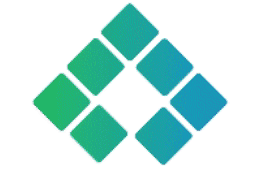
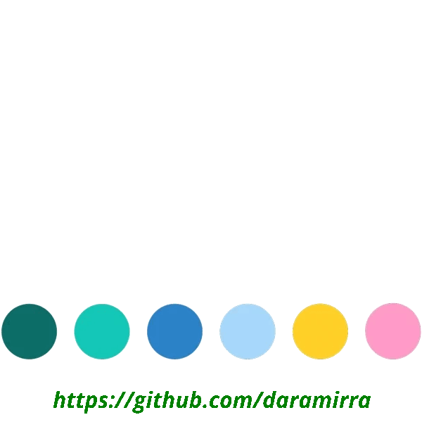
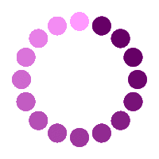

<!--
- ⚡⚡⚡  Уважаемые однокурсники! 
Если вам что-то приглянулось в моем оформлении и вы решили это что-то повзаимствовать, то не стесняйтесь оставить звездочку в благодарность за вдохновение )) 
- :herb: :purple_heart:
-->

  

:heavy_check_mark: *I’m having a 10+ years of experience in information technology industry. Currently I’m working **QA engineer**. I like to be involved in all stages of software development and provide customers with a quality product!*

## What am I currently up to?

:shamrock: *Currently I’m interesting test automation and starting to apply automation in my work. I have finished the course from **[QA.GURU school](https://qa.guru)** and successfully completed **[graduation work](https://github.com/daramirra/qaGuruDiploma)**. In the course program I studied the tools and practices of test automation, including:*

  
  
  
  
  
  
  
  
  

<h2> My projects </h2>

  
  
  
   
   
  

  

  <h2>Languages and tools</h2>

<!-- -->

   
  <code></code>
  <code></code>
  <code></code>
  <code></code>
  <code></code>
  
  <code></code>
  <code></code>
  <code></code>
  <code></code>
  <code></code> 
  
  <code></code>
  <code></code>
  <code></code>
  <code></code>
  <code></code>
<!-- <code></code> -->
 

### :open_umbrella: When I'm not testing you can find me:

:mushroom:  <code><strong>*Cooking*</strong></code>

:open_book:  <code><strong>*Reading*</strong></code>

:headphones: <code><strong>*Listening the music*</strong></code> 

:herb: <code><strong>*Taking care of plants*</strong></code> 

:purple_heart:  <code><strong>*Watching the sunset*</strong></code>

<h2> Contacts </h2>

 

  

  

<!--
|  |  |
| ------------- | ------------- |
-->
